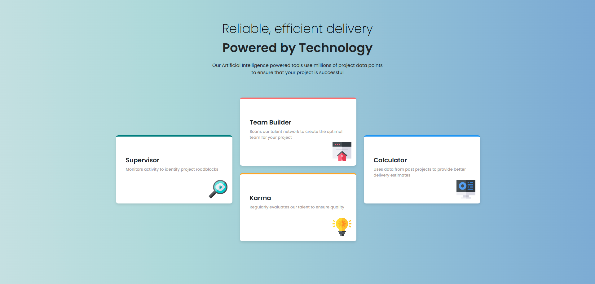
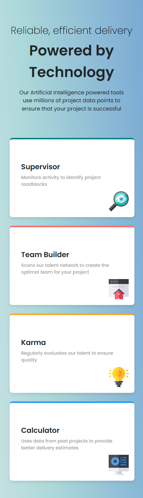

# Frontend Mentor - Four card feature section solution

This is a solution to the [Four card feature section challenge on Frontend Mentor](https://www.frontendmentor.io/challenges/four-card-feature-section-weK1eFYK). Frontend Mentor challenges help you improve your coding skills by building realistic projects.

## Table of contents

- [Overview](#overview)
  - [The challenge](#the-challenge)
  - [Screenshot](#screenshot)
  - [Links](#links)
- [My process](#my-process)
  - [Built with](#built-with)
  - [What I learned](#what-i-learned)
  - [Useful resources](#useful-resources)

## Overview

### The challenge

Users should be able to:

- View the optimal layout for the site depending on their device's screen size

### Screenshot




### Links

- Solution URL: [https://github.com/npc-makinika/Four-card-featur-section-ver2.git](https://github.com/npc-makinika/Four-card-featur-section-ver2.git)
- Live Site URL: [https://npc-makinika.github.io/Four-card-featur-section-ver2/](https://npc-makinika.github.io/Four-card-featur-section-ver2/)

## My process

### Built with

- Semantic HTML5 markup  
- CSS custom properties  
- Flexbox & CSS Grid  
- Mobile-first responsive workflow  
- [Bootstrap 5](https://getbootstrap.com/) — layout & components  
- [Google Fonts](https://fonts.google.com/specimen/Poppins) — typography  
- CSS transitions & transforms for smooth hover effects

### What I learned
Use this section to recap over some of your major learnings while working through this project. Writing these out and providing code samples of areas you want to highlight is a great way to reinforce your own knowledge.

To see how you can add code snippets, see below:
HTML Structure
1. Responsive Grid Layout with Bootstrap
```html
<section class="container-fluid">
  <div class="container my-5">
    <div class="row justify-content-center gx-4 gy-4">
```
- container-fluid: creating a full-width container spanning the entire viewport width.
- container my-5: centering the content with fixed max width and adds vertical margin (top and bottom) of about 3rem (48px).
- row justify-content-center gx-4 gy-4: defining a flexbox row that centers its child columns horizontally and adding horizontal (gx-4) and vertical (gy-4) spacing (gaps) between them.

2. Card Column and Content Example
```html
<div class="col-12 col-lg-4 d-flex align-items-center">
  <div class="supervisor card">
    <div class="card-body">
      <div class="text-area">
        <h2 class="card-title">Supervisor</h2>
        <p class="card-text">Monitors activity to identify project roadblocks</p>
      </div>
      
    </div>
  </div>
</div>
```
- col-12 col-lg-4: Makes the column full width (12 units) on small screens and one-third width (4 units) on large screens.
- d-flex align-items-center: Turns the column into a flex container and vertically centers its content.
- supervisor card: Applies styling for this specific card, e.g., border color.
- card-body: Wrapper for card content (text and icon).
- card-title and card-text: Title and descriptive text for the card.
- card-icon: Positioned icon for visual enhancement.

3. Vertical Stacking and Spacing with Flexbox
```html
<div class="col-12 col-lg-4 d-flex flex-column align-items-center justify-content-between gap-4">
  <div class="team-builder card w-100">
    <div class="card-body">
      <div class="text-area">
        <h2 class="card-title">Team Builder</h2>
        <p class="card-text">Scans our talent network to create the optimal team for your project</p>
      </div>
      
    </div>
  </div>
```
- d-flex flex-column align-items-center justify-content-between gap-4:
 - arranging child cards vertically (flex-column).
 - centering the items horizontally (align-items-center).
 - spacing the items evenly with justify-content-between.
 - adding medium gap (gap-4) between cards (~1.5rem or 24px).
 - team-builder card w-100: The card to fill 100% of the column’s width.


4. Additional Card Example
```html
<div class="karma card w-100">
  <div class="card-body">
    <div class="text-area">
      <h2 class="card-title">Karma</h2>
      <p class="card-text">Regularly evaluates our talent to ensure quality</p>
    </div>
    
  </div>
</div>
```
- Another card stacked vertically below "Team Builder" inside the same column.
- Same styling principles: full width, descriptive text, and icon.

CSS Highlights
1. Background Gradient
 ```css
- background: linear-gradient(266deg, #7aa9d4, #acd8d9 70%, #c5e0e1);
```
- applying a smooth, modern gradient background instead of a flat color.

2. Text Styling and Wrapping
 ```css
.text-2 {
  white-space: normal;
  word-wrap: break-word;
  overflow-wrap: break-word;
  text-align: center;
  max-width: 600px;
  margin: 0 auto;
  padding: 0 20px;
}
```
- Styling paragraphs to:
 - Break long words to prevent overflow.
 - Center the text horizontally.
 - Limit the max width for better readability.
 - Add horizontal padding.

3. Container Flexbox Layout
 ```css
.container-fluid {
  display: flex;
  flex-wrap: wrap;
  justify-content: center;
  padding-left: 15px;
  margin-top: 50px;
}
```
- making the container a flexbox wrapper.
- allowing items to wrap to new lines on smaller screens (flex-wrap: wrap).
- centering items horizontally.
- adding left padding and margin on top.

4. Card Styling with Responsive Width
 ```css
.card {
  width: clamp(520px, 30vw, 355px);
  min-height: 220px;
  position: relative;
  border: none;
  border-radius: 8px;
  overflow: hidden;
  box-shadow: 0 4px 8px rgba(0, 0, 0, 0.1);
  padding: 16px;
}
```
- adjusting Card width based on screen size with clamp.
- using the minimum height for ensuring consistent size.
- using the rounded corners for subtle shadow, and internal padding for clean styling.

5. Card Hover Effect
 ```css
.card:hover {
  box-shadow: 10px 5px 5px rgb(0, 0, 0);
  transition: box-shadow 0.3s ease-in-out;
  cursor: pointer;
}
```
- adding a shadow effect on hover.
- using smooth transition for the shadow over 0.3 seconds.
- changing cursor to pointer to indicate interactivity.

6. Icon Positioning
 ```css
.card-icon {
  position: absolute;
  bottom: 16px;
  right: 16px;
  width: 16%;
  height: auto;
  object-fit: cover;
}
```
- positioning card icons at the bottom-right corner.
- scaling the icon width relative to card size.

7. Removing Padding on Row Children
 ```css
.row > div {
  padding-left: 0;
  padding-right: 0;
}
```
- removing the side padding from direct child divs of .row to prevent unwanted spacing.

8. Responsive Row Layout
 ```css
.row {
  display: flex;
  flex-wrap: wrap;
  justify-content: center;
  gap: 2rem;
}
```
- creating a flexible, wrapping row.
- centering items horizontally.
- adding a consistent spacing (gap) of 2rem (~32px) between items.

9. Responsive Columns
 ```css
.col-12.col-lg-4 {
  flex: 0 0 33.3333% !important;
  max-width: 33.3333% !important;
  display: flex !important;
  flex-direction: column;
  padding: 0 10px;
}
```
- defining columns to take one-third width on larger screens.
- using flex layout inside the column.
-  adding horizontal padding for spacing.

10. Even Distribution of Columns
 ```css
.row {
  justify-content: space-between;
}
```
- distributing the columns evenly with space between them.

### Useful resources
1. Boostrap:

- [Bootstrap ](https://getbootstrap.com/docs/5.3/getting-started/introduction/) - This helped me understand how to use Bootstrap's grid system and utility classes effectively. It was particularly useful for organizing content and ensuring responsiveness across different screen sizes.

- [Bootstrap 5 Grid Layout – Official Docs](https://getbootstrap.com/docs/5.0/layout/grid/) - Comprehensive guide to Bootstrap’s responsive grid system, breakpoints, and layout options.

- [Bootstrap 5 Grid Basics – W3Schools](https://www.geeksforgeeks.org/bootstrap/bootstrap-5-layout-gutters/) - Explains how to add and customize gutters in Bootstrap 5 layouts.

- [Bootstrap 5 Grid Basics – W3Schools](https://www.w3schools.com/bootstrap5/bootstrap_grid_basic.php) - Beginner-friendly introduction to the Bootstrap 5 grid system with practical examples.

- [Bootstrap 4 Grid System – W3Schools](hhttps://www.w3schools.com/bootstrap4/bootstrap_grid_system.asp) - Overview of the Bootstrap 4 grid system, still relevant for legacy projects.

- [Bootstrap 4 Sizing Utilities](https://getbootstrap.com/docs/4.0/utilities/sizing/) - Official Bootstrap reference for setting element width and height using utility classes.

2. CSS Styling & Layout:

- [Google Fonts](https://fonts.google.com/) - This resource was invaluable for integrating custom fonts into my project.

- [CSS Tricks (Flexbox Guide) ](https://css-tricks.com/snippets/css/a-guide-to-flexbox/) - This article on Flexbox helped me understand how to align and distribute space among items in a container, which was essential for styling my stats section and ensuring it looked good on all devices.

- [CSS Tricks (Media Queries Guide) ](https://css-tricks.com/snippets/css/media-queries-for-standard-devices/) - This is an amazing reference for setting up media queries. It helped me ensure my layout looks great on different screen sizes, and I’d recommend it to anyone working on responsive designs.

- [MDN Web Docs on CSS Media Queries](https://developer.mozilla.org/en-US/docs/Web/CSS/CSS_media_queries/Using_media_queries) - This resource was crucial for learning how to apply different styles based on screen size. It allowed me to create a responsive design that adapts to various screen resolutions.

- [CSSmatic - Border Radius Generator ](https://www.cssmatic.com/border-radius) - Helpful for experimenting and generating CSS styles such as border radius, box shadow, and more.

3. CSS Properties & Functions:

- [CSS gap – MDN Docs](https://developer.mozilla.org/en-US/docs/Web/CSS/gap)  - Details on the gap property for spacing in CSS Grid and Flexbox layouts.

- [CSS Gradient Generator – CSSGradient.io](https://cssgradient.io/) - Tool to visually create custom gradients and copy the CSS code.

- [linear-gradient() – MDN Docs](https://developer.mozilla.org/en-US/docs/Web/CSS/gradient/linear-gradient)  - Technical documentation for the linear-gradient() CSS function.

- [white-space – MDN Docs](https://developer.mozilla.org/en-US/docs/Web/CSS/white-space) - white-space – MDN Docs – Explains how to control the handling of whitespace inside elements.

- [word-break – MDN Docs](https://developer.mozilla.org/en-US/docs/Web/CSS/word-break) - Defines how words should break when reaching the end of a line.

- [overflow-wrap – MDN Docs](https://developer.mozilla.org/en-US/docs/Web/CSS/overflow-wrap) - Guides on forcing text to break to prevent overflow issues.

- [flex-wrap – MDN Docs](https://developer.mozilla.org/en-US/docs/Web/CSS/flex-wrap) - Explains how flex items wrap onto multiple lines in a flex container.

- [clamp() – MDN Docs](https://developer.mozilla.org/en-US/docs/Web/CSS/clamp) - Reference for the clamp() function, useful for creating responsive values.

- [transition – MDN Docs](https://developer.mozilla.org/en-US/docs/Web/CSS/transition) - Covers how to smoothly animate changes in CSS property values.


